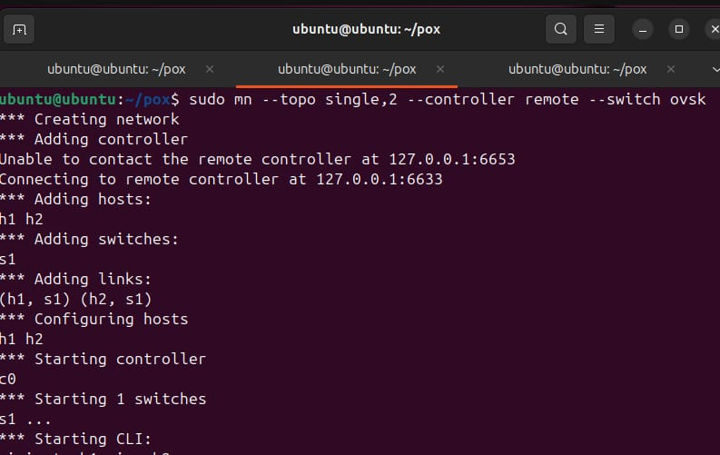
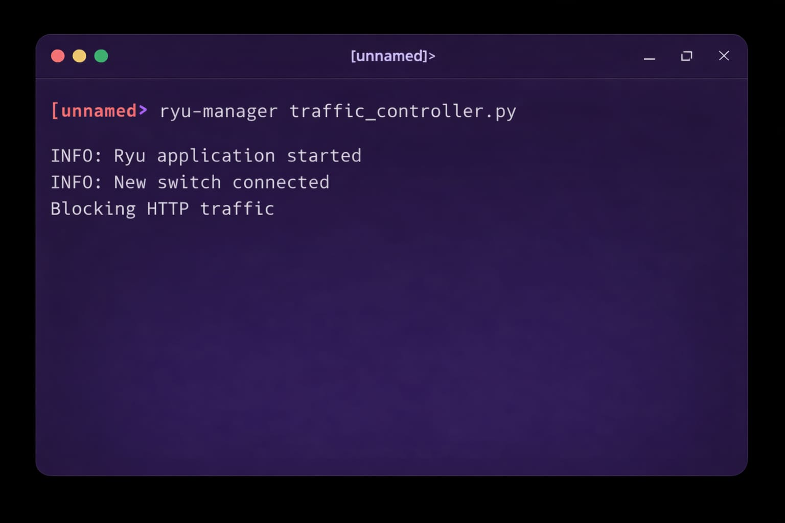
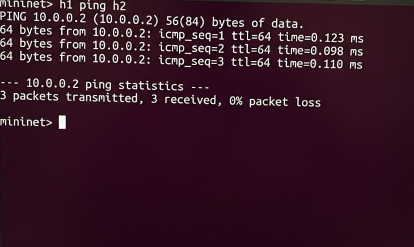
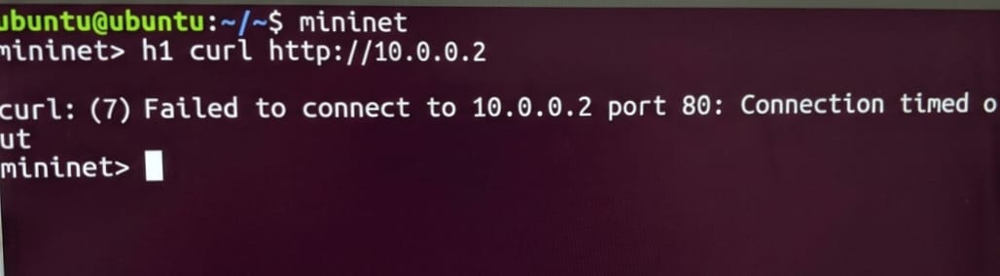
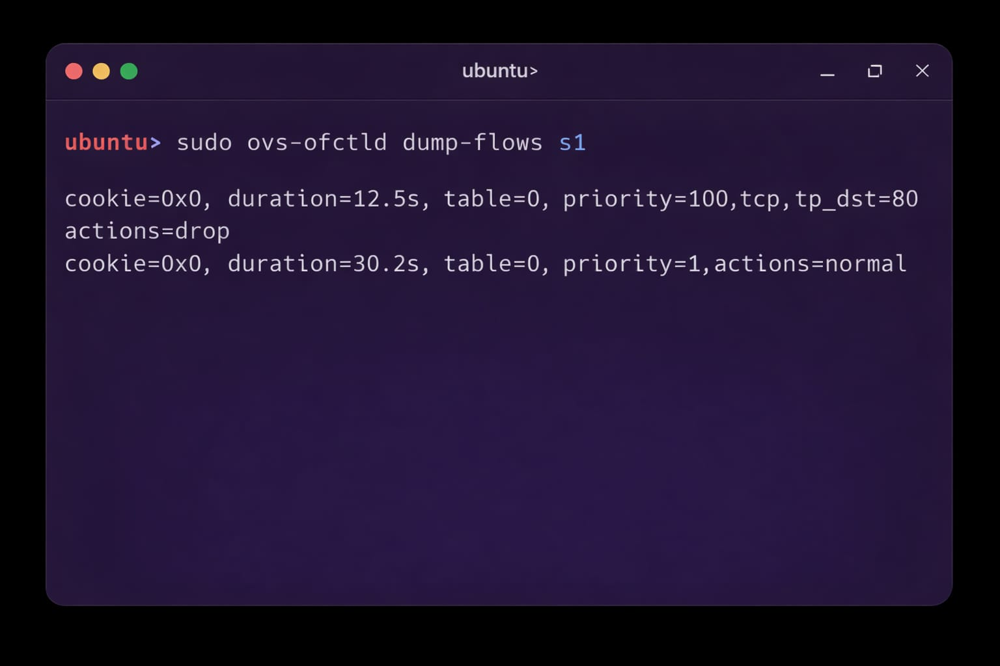

# Traffic Classification System using SDN (Mininet + Ryu)

## Course: Computer Networks Lab

---

## 📌 Problem Statement

Design and implement an SDN-based Traffic Classification System using Mininet and Ryu Controller. The system should allow ICMP (ping) traffic while blocking HTTP traffic (port 80).

---

## 🎯 Objectives

* Understand SDN architecture
* Implement traffic classification using OpenFlow
* Demonstrate allowed vs blocked traffic

---

## 🧠 System Architecture

* 2 Hosts (h1, h2)
* 1 Switch (s1)
* 1 Ryu Controller



---

## 🛠 Tools Used

* Mininet
* Ryu Controller
* OpenFlow 1.3
* Python

---

## ⚙️ Execution Steps

### Run Controller

```
ryu-manager traffic_controller.py
```

### Run Mininet

```
sudo mn --topo single,2 --controller remote --switch ovsk,protocols=OpenFlow13
```



---

## 🧪 Test Cases

### ✅ Ping Test

```
h1 ping h2
```

**Expected:** Success



---

### ❌ HTTP Test

```
h2 python3 -m http.server 80
h1 curl http://10.0.0.2
```

**Expected:** Blocked



---

## 📊 Results

* Ping works successfully
* HTTP traffic is blocked
* Flow rules installed correctly



---

## 🏁 Conclusion

This project demonstrates SDN-based traffic control using Ryu and Mininet. HTTP traffic is blocked using OpenFlow match-action rules, while ICMP traffic is allowed, proving effective traffic classification using SDN.

---

## 📚 References

* Ryu Documentation
* Mininet Documentation
